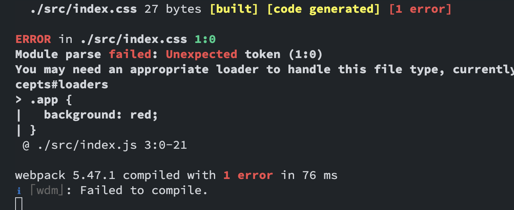
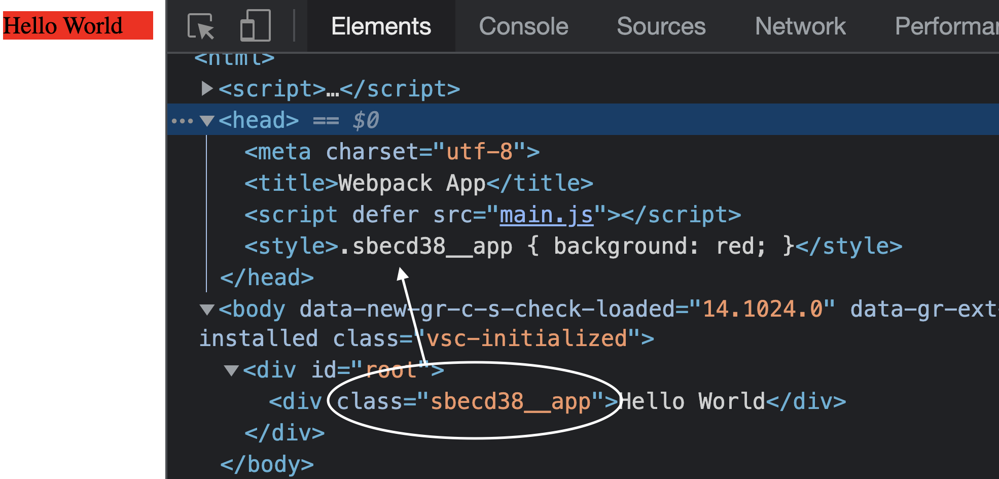

# Writing the Loader

So what are we aiming for?
First thing first, we want to just load our CSS from our JS.

Let's create our CSS file and call it `index.css`.
```css
.app {
	background: red;
}
```

And of course, use it in the index.js file:
```js
import React from 'react';
import { render } from 'react-dom';
import './index.css'

render(
  <div className="app"> Hello World! </div>,
  document.getElementById('root')
);
```

Run our application:
```bash
npm run serve
```

Now you probably see this error in the console:


This error makes a lot of sense, webpack does not know how to handle CSS imports, and we should tell it how.

## Creating Webpack Loader

### What are loaders?

*webpack enables use of loaders to preprocess files. This allows you to bundle any static resource way beyond JavaScript.*

To put it simply for our case, they are functions that take the CSS file as input and output a js file\
_**CSS -> JS**_

### Loader implementation

Let's create a file parallel to the `webpack.config.js` named `loader.js`.
Our goal is to append the style value we get from the CSS file inside the dom.

`loader.js`:
```js

// Appending the style inside the head
function appendStyle(value) {
    const style = document.createElement('style');
    style.textContent = value;
    document.head.appendChild(style);
}

// Make sure it is not an arrow function since we will need the `this` context of webpack
function loader(fileValue) {
  // We stringify the appendStyle method and creating a file that will invoked with the css file value in run time
  return `
    (${appendStyle.toString()})(${JSON.stringify(fileValue)})
  `
}

module.exports = loader;
```

Now we need to register it inside the webpack config.

`webpack.config.js`:
```js
const config = {
  //... rest of the config
    module: {
        rules: [
          // ... other rules not related to CSS
            {
                test: /\.css$/,
                loader: require.resolve('./loader')
            }
        ]
    }
  // ...
}
```

Restart the terminal, and we got it! 🎊


### What is happening behind the scenes?

Webpack sees your CSS import inside the `index.js`. It looks for a loader and gives it the javascript value we want to evaluate in runtime.

## Overcoming the `global` issue

Now we have our style, but everything is global.
Every other language solves the global issue with scoping or namespacing.

We will implement the namespace solution.
This going to give us scoping, and each file going to have its own namespace.

For example, our import is going to look like this:
```
AppComponent123__myClass
```

And if another component has the same class name, it won't matter behind the sense since the namespace will be different.

Let's go the `loader.js` and add the following method:
```js

const crypto = require('crypto');

/**
 * The name is the class we are going to scope, and the file path is the value we are going to for the namespacing.
 * 
 * The third argument is the classes, a map that points the old name to the new one.
 */
function scope(name, filepath, classes) {
  name = name.slice(1); // Remove the dot from the name.
  const hash = crypto.createHash('sha1'); // Use sha1 algorithm.
  hash.write(filepath); // Hash the filepath.
  
  const namespace = hash.digest('hex').slice(0, 6); // Get the hashed filepath.
  const newName = `s${namespace}__${name}`;

  classes[name] = newName; // Save the old and the new classes.

  return `.${newName}`
}
```

After we are done scoping the class, let's return the loader method.
We need a way to connect the scoped class selector to the user's javascript code.

```js
function loader(fileValue) {
  const classes = {}; // Map that points the old name to the new one.
  const classRegex = /(\.([a-zA-Z_-]{1}[\w-_]+))/g; // Naive regex to match everything that start with dot.
  const scopedFileValue = fileValue.replace(classRegex, (name) => scope(name, this.resourcePath, classes)); // Replace the old class with the new one and add it to the classes object

 // Change the fileValue to scopedFileValue and export the classes.
  return `
    (${appendStyle.toString()})(${JSON.stringify(scopedFileValue)})

    export default ${JSON.stringify(classes)}
  ` // Export allows the user to use it in his javascript code
}
```

In the `index.js` now we can use it as an object:

```js
import React from 'react';
import { render } from "react-dom";
import classes from './index.css'; // Import the classes object.

render(
  <div className={classes.app}>
    Hello World
  </div>,
  document.getElementById('root')
)
```

Now it works with namespaced selector 🎉



<mark>Some important points about the changes we implemented.</mark>

* When the loader is used by Webpack, the context will be the loader context (`this`) from Webpack. You can read more about it [here](https://webpack.js.org/api/loaders/). It provides the resolved file path, which makes the namespace unique to the file.
* The way we extract the classes selectors from the CSS file is naive implementation which not taking to account so other used cases. The ideal way is to use a CSS parser.
* `this.resourcePath` refers to the local path, which mean that in other machine the path would look different

The loader is implemented, we got scoped classes.
But, everything is loaded from javascript, and if we would like to cache the CSS it is impossible at the moment.
We will need to compose all the CSS into one file and for that we will need to create a Webpack Plugin.

## [Next chapter](./css-plugin.md)
### [Previous chapter](./setup-the-solution.md)
