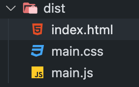
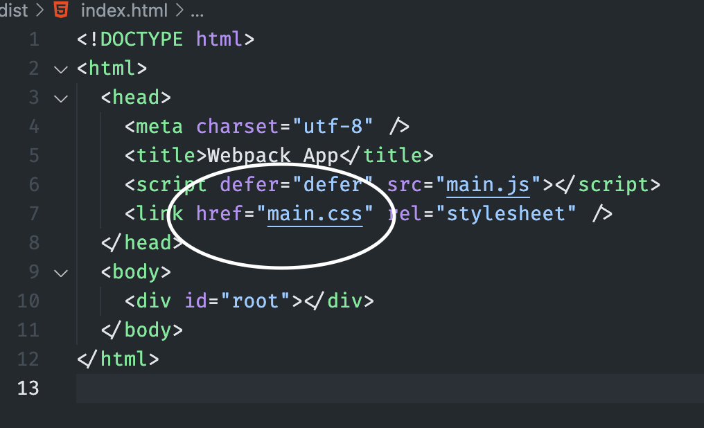

# Writing an advanced Plugin
​
As said, we implemented a loader that can inject CSS into our page. What if we want to do it with a signal file and not an injection, however?
​
Loading CSS as a file comes with many benefits, and the best of them is caching. The browser can cache the file and won't need to redownload it every time it is needed.
​
This operation is more complicated than the loader case since we will have more context about the Webpack bundling process.
​
### What is a plugin?
​
*A Webpack plugin is a JavaScript object that has an [apply](https://developer.mozilla.org/en-US/docs/Web/JavaScript/Reference/Global_Objects/Function/apply) method. This apply method is called by the Webpack compiler, giving access to the entire compilation lifecycle.*
​
​
## Creating the Plugin
​
Let's create a file called `plugin.js`, and create the plugin skeleton: 
​
```js
​
class CSSPlugin {
  cssMap = new Map() // We will save here the CSS content
​
  /**
   * Hook into the compiler
   * @param {import('webpack').Compiler} compiler 
   */
  apply(compiler) { }
}
​
module.exports = {
  CSSPlugin
}
​
```
​
​
Now let's implement the apply method: 
​
```js 
class CSSPlugin {
  cssMap = new Map() // We will save here the CSS content
​
  /**
   * Hook into the compiler
   * @param {import('webpack').Compiler} compiler 
   */
  apply(compiler) {
​
    // Hook into the global compilation.
    compiler.hooks.thisCompilation.tap('CSSPlugin', (compilation) => {
​
      // Hook into the loader to save the CSS content.
      compiler.webpack.NormalModule.getCompilationHooks(compilation).loader.tap(
        'CSSPlugin',
        (context, module) => {
​
          // Setting up a method on the loader context that we will use inside the loader.
          context.setOutputCSS = (css) => {
​
            // the key is the resource path, and the CSS is the actual content.
            this.cssMap.set(module.resource, css)
          }
        }
      )
    })
   }
}
```
​
​
We hooked into the global compilation and then hooked into the loader (which was implemented in the previous chapter).
​
When the loader content is reachable, we add the `setOutputCSS` method to call it from the loader.
​
Here's how to call this method in `loader.js`:
​
```js
function loader(fileValue) {
  const classes = {}; // Map that points the old name to the new one.
  const classRegex = /(\.([a-zA-Z_-]{1}[\w-_]+))/g; // Naive regex to match everything that start with dot.
  const scopedFileValue = fileValue.replace(classRegex, (name) => scope(name, this.resourcePath, classes)); // Replace the old class with the new one and add it to the classes object
​
  this.setOutputCSS(scopedFileValue) // Pass the scoped CSS output
​
 // Export the classes.
  return `export default ${JSON.stringify(classes)}`
}
​
```
​
As you can see, we are not appending the style in the JavaScript. We use the method we added to the context.
​
After collecting all the scoped CSS content, we now need to hook into the asset process hook to let the compiler know that we have a new asset that it should handle.
​
Let's add it to the `apply` method:
​
```js
class CSSPlugin {
  // ...
​
  apply(compiler) {
      compiler.hooks.thisCompilation.tap(
        'CSSPlugin', 
        (compilation) => {
        // ...
​
        // Hook into the process assets hook
        compilation.hooks.processAssets.tap(
          {
            name: 'CSSPlugin',
            stage: compiler.webpack.Compilation.PROCESS_ASSETS_STAGE_DERIVED
          },
          () => {
​
                // Loop over the CSS content and add it to the content variable
                let content = '';
                for (const [path, css] of this.cssMap) {
                  content += `/* ${path} */\n${css}\n`;
                }
​
                // Append the asset to the entries.
                for (const [name, entry] of compilation.entrypoints) {
                  assetName = `${name}.css`;
                  entry.getEntrypointChunk().files.add(assetName);
                }
​
                // Create the source instance with the content.
                const asset = new compiler.webpack.sources.RawSource(content, false);
​
                // Add it to the compilation
                compilation.emitAsset(assetName, asset);
          }
      )
  }
}
```
​
Now we'll run the build command:
​
```bash
npm run build
```
​
We should see `main.css` in the output folder, and also injected into the HTML:\
Output:\
\
`index.html`:\
\
And that's it!\
We finished the Plugin and have one CSS file for all of the CSS.
​
Note that we skipped dependencies, graph ordering, and filtering unused CSS for demonstration purposes.
​
You can see my full implementation with typescript and tests, [here](../README.md) in this repo.
​
If you have any question you can reach me via [linkedin](https://www.linkedin.com/in/tzach-bonfil-21b822187/). I hope I managed to help you. Have a good one!
​
### [Previous chapter](./css-loader.md)
